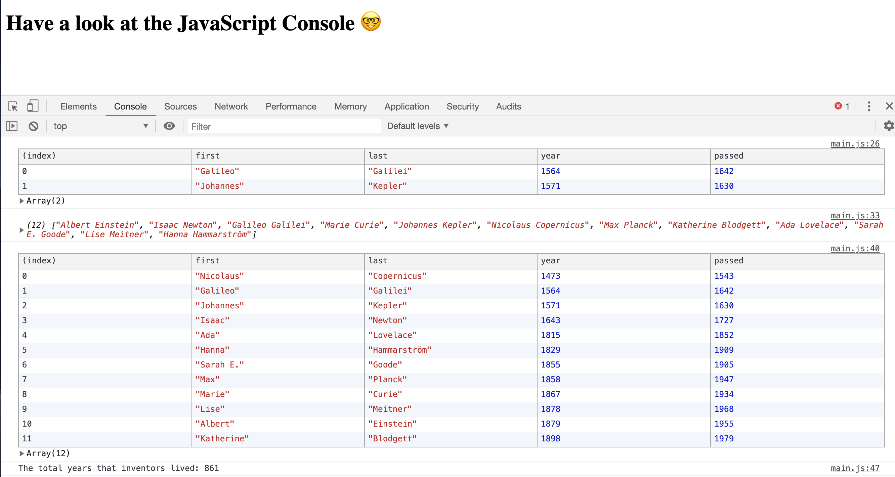

# 04. Array Cardio Day1

#### _Array Cardio Day1 by JavaScript30 10/04/19_

## Description
This is a console demo of array prototype methods, 4th application out of 30 by 30 day Vanilla JavaScript Coding Challenge by Wes Bos.<br>
Please check the challenge from [JavaScript30](http://wesbos.com/javascript30/).




## About Exercises:

1. `.filter()` method - filters the inventors born in 1500s.
2. `.map()` method - return an array of inventors full name (`first` + `last`).
3. `.sort()` method - sort the inventors by birth year (oldest to latest).
4. `.reduce()` method - return total years that all the inventors lived.
5. `.sort()` method - sort inventors by years lived (longest to shortest).
6. `.sort()` method - sort the people in 'people' array alphabetically by last name.
7. `.reduce()` method - sum up the duplication of item in 'data' array.
8. `.map()` and `.filter()` method - return an array of street name with 'de'. **Open the console in wikipedia link, and copy and paste the commented out codes.**


## Setup/Installation Requirements

1. Clone this repo:
```
$ git clone https://github.com/misakimichy/JS30-04-array-cardio-day1.git
```

2. Navigate to the top level of the cloned directory.

3. Open `index.html` with your preferred web browser.

4. Open the JavaScript console.

5. For exercise 8, open the JavaScript console in the link (line 84).

## Known Bugs
* No known bugs at this time.

## Support and contact details
 I welcome any feedbacks and comments: misaki.koonce@gmail.com

## Technologies Used
_Git, GitHub, HTML, CSS, Vanilla JavaScript

## License
Copyright © 2019 under the MIT License